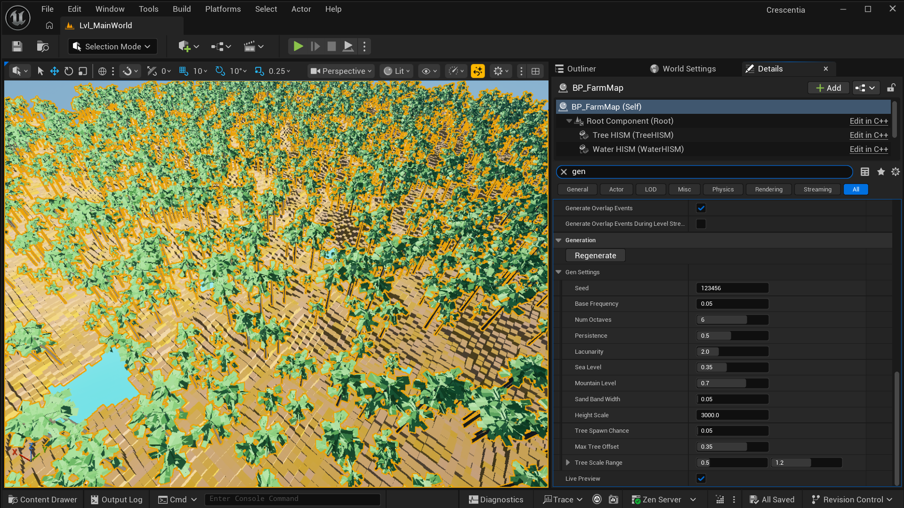

# Crescentia

A 3D farming life-sim inspired by Stardew Valley, where every farm is procedurally generated.



## About
Stardew Valley, and Eric Barone's story behind it, are a big part of why I became a game programmer.
Crescentia is my long-term dream project: a 3D farming life-sim I intend to keep building for years.
It is also where I sharpen my C++ and Unreal Engine skills, the craft that will fund that dream.

- **Long-term vision:** seasons, survival, combat and NPCs.
- **Current focus:** the core loop: clear land, plant by season, harvest, sell, upgrade your home.

Built C++-first in Unreal Engine 5.8. Blueprints are used only for data and tuning.

## Current status
Early development. Implemented so far:
- Procedural farm generation (fractal Perlin noise, tile classification)
- Deterministic, seed-based generation with independent RNG streams per system
- Data/view separation: world data is pure, rendering only reads it
- Live preview in the editor: tweaking any setting regenerates the farm
- Placeholder rendering with instanced meshes (HISM), to be replaced by a terrain mesh

## Architecture
```text
WorldGenSettings -> FarmGenerator -> FarmGrid (world data) <- Save (planned)
                                         ^
                                         |
                                      FarmMap (reads data, builds visuals)
```

## Key design decisions
- **Data/view separation.** `FarmGrid` holds the world as pure data; `FarmMap` only reads it to build
  visuals, and all edits go through `FarmMap` so data and visuals never drift apart. Rendering can change
  (e.g. instanced cubes to a terrain mesh) without touching world logic.
- **Deterministic generation.** Every pass draws from its own `FRandomStream`, seeded from a hash of the
  world seed and a per-pass salt. The same seed and settings always rebuild the same farm, and adding a new
  pass never reshuffles existing ones. Trade-off: the order of random draws inside a pass must stay stable.
- **Stateless generator.** `FarmGenerator::Generate(Settings, World)` takes validated settings in and
  writes a world out, with no hidden state between runs.
- **Units that rule out invalid states.** Heights are baked in cm, tree offsets are stored as tile
  fractions, and trees are keyed by tile index, so a tree can never leave its tile and a tile can never
  hold two trees.
- **Save the world, not the recipe** *(planned)*. Saves will store a full world snapshot (~1 MB) instead of
  seed + changes, so generator updates can never corrupt existing saves. Trade-off: bigger save files.

## Roadmap
- [ ] Region-based terrain shaping: clear plains, plateaus and mountains
- [ ] Farm layouts: guaranteed house clearing, town exit and an always-walkable path
- [ ] Water: ponds now, rivers with bridges later
- [ ] Terrain mesh with chunked collision
- [ ] Third-person player and tile targeting
- [ ] Core loop: chopping, tilling, planting by season, selling
- [ ] Save/load (full world snapshot)

## Building
Requirements: Unreal Engine 5.8, JetBrains Rider (or Visual Studio 2022 with the C++ game
development workload), Git LFS.

1. `git lfs install`, then clone the repository.
2. Open `Crescentia.uproject` directly in Rider, or right-click it and choose
   *Generate Visual Studio project files*.
3. Build the `CrescentiaEditor` target in *Development Editor* and run.
4. Open `Content/World/Lvl_MainWorld` and press Play.
   Generation settings live on `Content/World/Farm/BP_FarmMap`.

## Contact
- GitHub: https://github.com/demondrac05
- Email: thangphanfk@gmail.com
- LinkedIn: https://www.linkedin.com/in/thang-phan-3b702321b